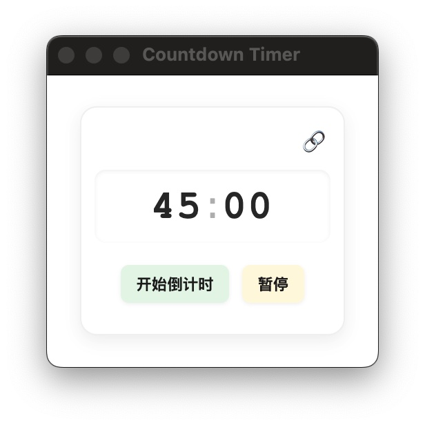

# 倒计时应用 (CountDown)

一个简洁、轻量级的桌面倒计时工具，基于Electron开发，适用于工作/学习的专注时间管理。

## 功能特点

- **专注计时**: 默认45分钟工作，10分钟休息的番茄工作法
- **窗口置顶**: 可选择将窗口置顶，方便查看剩余时间
- **紧凑界面**: 极简设计，占用桌面空间小
- **视觉提醒**: 时间结束时通过背景闪烁提醒
- **休息提示**: 工作结束后自动进入休息计时

## 界面预览



## 安装方法

### 从源码构建

1. 克隆仓库
```bash
git clone https://github.com/your-username/CountDown.git
cd CountDown
```

2. 安装依赖
```bash
npm install
```

3. 运行应用
```bash
npm start
```

## 使用说明

- **开始计时**: 点击"开始倒计时"按钮
- **暂停/继续**: 点击"暂停"或"继续倒计时"按钮
- **重置**: 在计时过程中，点击"重置倒计时"按钮可重置计时器
- **窗口置顶**: 点击右上角的置顶按钮(📌/🔗)切换窗口置顶状态
- **工作/休息切换**: 工作时间结束后，点击"确认"按钮进入休息时间；休息时间结束后，再次点击"确认"按钮

## 技术栈

- Electron: v36.3.1

## 开发者

- Eboher

## 许可证

MIT License